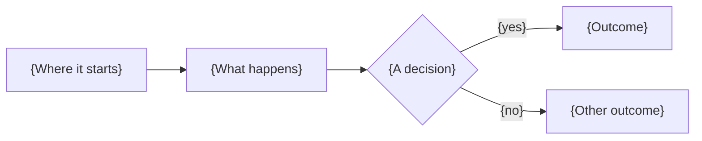

# Final Review Template & Synthesis Guide

> **Output file**: `rounds/round-{n}/final.md`
> **Manifest**: See `references/session-files.md` for authoritative file names

This guide describes how to synthesize all findings into a unified final review. Save output to `rounds/round-{n}/final.md`.

## Philosophy: Model Real Engineering Teams

This synthesis process is designed to mirror how high-performing engineering teams (Google, Stripe, etc.) conduct code review, following principles articulated by Martin Fowler and the continuous delivery community:

1. **Any reviewer can block** — A single engineer identifying a critical issue (security vulnerability, data integrity risk, correctness bug) can block a merge. This is non-negotiable.

2. **No feedback is lost** — Every finding from every reviewer surfaces in the final output. Who raised it is recorded in `round-meta.json` (`flagged_by`, `sources`) and shown by the dashboard; the prose of `final.md` talks about the code, not about the reviewers.

3. **Suggestions are suggestions** — Non-blocking feedback (style preferences, refactoring ideas, minor improvements) is presented for consideration but doesn't prevent merge.

4. **Tech Lead synthesizes, doesn't override** — The Tech Lead aggregates and presents all feedback with a recommendation, but doesn't suppress minority opinions or "outvote" blockers.

5. **Trust and autonomy** — Authors are trusted to address feedback appropriately. Reviews are collaborative conversations, not gatekeeping.

## Purpose

- **Explain the change** — What the task wants and how it was built, step by step, so a reader who has not seen the diff can follow
- **Preserve all feedback** — Every finding from every reviewer appears, told in plain language
- **Identify blockers** — Surface anything that should prevent merge
- **Categorize should-fix items** — Issues that aren't blocking but should be addressed
- **Present suggestions** — Lower-priority improvements for author consideration
- **Assess requirements** — Evaluate against provided requirements (if any)
- **Recommend action** — Clear verdict with rationale

## Synthesis Process

### Language

Synthesis prose follows the configured `language` (see `references/language-policy.md`; omitted when `en`). Every heading, label, verdict value and category in the template is literal English. `round-meta.json` values are unaffected.

### Step 1: Gather All Feedback

Collect without filtering (see `references/session-files.md` for file names):
- All individual reviews from current round (`rounds/round-{n}/reviews/{type}-{n}.md`)
- Discourse results (`rounds/round-{n}/discourse.md`) if available
- Requirements context (`requirements.md`) if provided
- Tech Lead's original analysis from `context.md`

**Critical**: Do not discard or "deduplicate away" any reviewer feedback at this stage.

### Step 2: Identify Blockers

A finding is a **blocker** if ANY of the following are true:

| Blocker Criteria | Examples |
|------------------|----------|
| **Security vulnerability** | SQL injection, auth bypass, secrets exposure |
| **Data integrity risk** | Race conditions causing data loss, silent failures |
| **Correctness bug** | Logic errors that produce wrong results |
| **Breaking change without migration** | API contract violations, schema changes without rollback |
| **Compliance violation** | GDPR, HIPAA, PCI-DSS requirements not met |

**Any single reviewer can flag a blocker.** This is not subject to consensus—one engineer seeing a security hole is sufficient to block.

### Step 3: Categorize Non-Blocking Findings

All non-blocking feedback is categorized into **Should Fix** or **Suggestions**, then preserved.

**Should Fix** — Issues that aren't blocking but should be addressed before or shortly after merge:

| Should Fix Criteria | Examples |
|---------------------|----------|
| **Code quality issues** | Missing error handling, dead code, untested critical paths |
| **Potential bugs** | Silent fallthrough, unvalidated input at boundaries, race conditions (non-data-loss) |
| **Important refactors** | DRY violations with real maintenance cost, tight coupling between modules |
| **Missing validation** | Input boundaries not enforced, missing null checks on external data |
| **Functional gaps** | Feature partially implemented, edge case not handled |

**Suggestions** — Low-priority improvements for author consideration:

| Suggestion Criteria | Examples |
|---------------------|----------|
| **Style preferences** | Naming, formatting, early returns vs nested ifs |
| **Minor refactors** | Extract small helper, reorder parameters, simplify expression |
| **Documentation** | Add JSDoc, clarify comment, update README |
| **Testing ideas** | Additional edge cases, snapshot tests, performance benchmarks |
| **Informational** | Alternative approaches, FYI notes, future considerations |

See the template below for how each item is written (Step 9).

**No feedback is lost.** Even if only one reviewer mentions something, it surfaces.

### Step 4: Resolve Disagreements Before Writing

Use the discourse to decide, not to narrate. When reviewers agree, the finding simply stands. When they disagree, check the code and write the conclusion. When it is a genuine trade-off with no right answer, present both options in plain words inside the item (no names) or turn it into a Clarifying Question for the author. `final.md` never has a consensus/dissent section: who said what lives in `discourse.md` and the dashboard.

### Step 5: Assess Requirements (if provided)

If requirements were provided, evaluate each against the implementation. When `requirements.md` has numbered criteria (`### AC-n:`), emit **one row per AC** and reference it as `AC-n` in the first column; never merge or skip ACs:

```markdown
## Requirements Assessment

| Requirement | Status | Notes |
|-------------|--------|-------|
| AC-1: Users can log in via OAuth | ✓ Met | Implementation complete |
| AC-2: Session tokens expire after 24h | ? Unclear | Expiry logic not visible in diff |
| AC-3: Failed logins are rate-limited | ✗ Gap | No rate limiting found |

**Gaps identified**: 1 requirement not met (AC-3 rate limiting)
**Needs clarification**: 1 requirement unclear (AC-2 token expiry)
```

A requirements gap MAY be a blocker if it represents a critical feature.

### Step 6: Collect Clarifying Questions

Keep every question reviewers raised, merged when they ask the same thing, as one plain list for the author (no "From @reviewer" grouping):

```markdown
## Clarifying Questions

- The spec says "fast response": what is the target latency?
- Should rate limiting be part of this PR or a follow-up?
```

### Step 7: Synthesize Verdict

The Tech Lead determines the verdict based on simple rules:

| Condition | Verdict | Rationale |
|-----------|---------|-----------|
| **Any blocker exists** | REQUEST CHANGES | Blockers must be resolved before merge |
| **Unanswered questions about requirements** | NEEDS DISCUSSION | Author should clarify intent |
| **Suggestions only, no blockers** | APPROVE | Trust author to consider suggestions |
| **No findings** | APPROVE | Code is ready to merge |

**Important**: The Tech Lead does NOT override blockers. If any reviewer flags a blocker, the verdict is REQUEST CHANGES regardless of other opinions.

Under the verdict, explain it in 2–3 plain sentences: what is solid, and what stands between the change and the merge (or that nothing does).

**Verdict and blocker count must point the same direction (CLI-enforced).** The verdict is now cross-checked against the deduplicated blocker count at `complete-round`:

- `REQUEST CHANGES` **requires at least one blocker** — if nothing is a blocker, the change is mergeable, so the verdict is `APPROVE` (carry the residual work as `should_fix`/`suggestion`/`style`).
- `APPROVE` **requires zero blockers** — a mergeable gate cannot coexist with a must-fix. If something truly must be fixed before merge, categorize it `blocker` and use `REQUEST CHANGES`.
- `NEEDS DISCUSSION` is unconstrained on blockers.

The CLI **rejects** a contradictory pair (exit 7, nothing written), so pick the verdict and the blocker categorization together.

**The verdict is the merge gate — one axis, three values.** It answers only "can this land?" Residual work is a *separate* axis: follow-ups (`should_fix`) and suggestions are finding **categories**, never verdict states. An `APPROVE` with open should-fix items is the normal, correct outcome — the work is tracked in the counts, not by bending the verdict into a composite like "approve with suggestions". Never emit a verdict outside the three canonical values.

---

### Step 8: Write the Plain-Language Overview

Before the verdict, `final.md` opens with `## What This Change Does`, written for a human who has not read the diff. It is **internal** — it is never posted (the single-human translation drops it).

- **`**What the task asks**`** — the goal in plain words, from `requirements.md` or the card when present; with no requirements, inferred from the PR description. Two to four sentences.
- **`**How it was built, step by step**`** — a numbered list in the **logical order of the implementation**, the way the author would explain it to a colleague: first the base the rest depends on (data, schema, contracts, types), then the logic that uses it, then where it connects (commands, endpoints, hooks), and last what the user sees (UI, posted text). Each step says in one to three sentences what was added or changed and why the next step needs it. Mention files only in passing (`pr.ts`), never as a file-by-file walk. Typically 4–8 steps.
- **One or two ` ```mermaid ` diagrams** — always one for the flow of the change (`flowchart` for a decision or workflow, `sequenceDiagram` when components or services talk over time). Add a second only when several components interact (a `sequenceDiagram`) or the change alters an existing flow (before → after). At most ~12 nodes or messages each; plain-word labels, double-quoted when they contain punctuation; no HTML and no `click` directives. A before → after diagram is ONE `flowchart LR` with two subgraphs with ASCII ids and quoted titles, `direction TB` inside each, and an invisible link between them so Mermaid keeps the order (without it, unconnected subgraphs can come out stacked and reversed):

  ```
  flowchart LR
      subgraph before["Before"]
          direction TB
          A1["..."] --> A2["..."]
      end
      subgraph after["After"]
          direction TB
          B1["..."] --> B2["..."]
      end
      before ~~~ after
  ```
- The bold labels are prose and follow the configured language; the heading stays in English.

### Step 9: Write Each Problem in Plain Language

Each item under `## Blockers`, `## Should Fix` and `## Suggestions` is told the way a senior engineer explains a problem to the author, not as a form:

- **Title**: what is wrong, in plain words ("An empty order crashes the total"), not a category ("Correctness issue").
- **Body**: one or two short paragraphs — what happens (the concrete scenario), why it matters (who or what it breaks), and what to do. Weave any evidence into the sentences ("running it with an empty list throws `TypeError`"). Add a code block only when it is the fix.
- **Last line**: the location and the id, e.g. `` `src/orders/total.ts:57` · **ID**: S1 `` (several locations separated with `, `). For a suggestion bullet, the `[S<n>]` prefix and the location at the end.
- **Never** in the item: reviewer handles, `**Flagged by**`, `**Type**`, `**Issue**`, `**Why this blocks**`, `**Evidence**`, or references to the discussion ("as principal-2 argued", "after the discourse").

### Step 10: Tag Every Item With Its Id

Every item in `final.md` is one synthesized finding, and its id is the `key` you assigned in `synthesis_findings` when you piped the round data (see `references/workflow.md`, Phase 7 step 7):

- **Blockers** and **Should Fix**: `**ID**: S<n>` on the item's last line, after its location (Step 9).
- **Suggestions**: an `[S<n>]` prefix at the start of each bullet.
- Keys are unique within the round and each appears exactly once. Items under `### Style` are tagged `[S<n>]` like any other bullet, but their `category` is `"style"`, so they are not counted as suggestions: `synthesis_counts.suggestions` is the number of `synthesis_findings` with `category: "suggestion"`. With `synthesis_findings` present, `synthesis_counts` is optional (derived from them).
- `ID` and `S<n>` are literal tokens: they stay as written whatever the output language.

### Step 11: Mark Already-Reported Items

For a synthesized finding whose `prior.status` is not `new` (see `references/workflow.md`, Phase 7 step 7), add one `**Already reported**` line to its item, just before its last line (Blockers and Should Fix) or at the end of its bullet (Suggestions). Items that are `new` get nothing.

- `open`: `**Already reported**: still open — <link>`
- `resolved_still_present`: `**Already reported**: marked fixed but still present — <link>`
- `changed`: `**Already reported**: code changed since — <link>`
- `dismissed`: `**Already reported**: dismissed — <link or round n of session>`

`<link>` is the `url` of each GitHub ref (several refs: separate them with `, `); for an `ocr` ref write the earlier round instead (`round <n> of <session_id>`). The label and the status words are prose and follow the configured language; the line is an internal pointer and is not posted as written (see `commands/translate-review-to-single-human.md` for what is).

---

## Final Review Template

````markdown
# Code Review: {branch/PR}

**Date**: {YYYY-MM-DD}

---

## What This Change Does

**What the task asks**

{The goal in plain words, from the requirements/card; if none, inferred from the PR description. Two to four sentences.}

**How it was built, step by step**

1. {The base: data, schema, contract or types added/changed, and why the rest needs it.}
2. {The logic that uses it.}
3. {Where it connects: command, endpoint, hook.}
4. {What the user sees.}



{Optional second diagram: a `sequenceDiagram` when several components interact, or before → after when an existing flow changes.}

---

## Verdict

**APPROVE** | **REQUEST CHANGES** | **NEEDS DISCUSSION**

**Blockers**: {N}
**Should Fix**: {N}
**Suggestions**: {N}

{2–3 plain sentences: what is solid, and what stands between the change and the merge (or that nothing does).}

---

## Blockers

{Only when there are blockers. Each one must be resolved before merge.}

### 🚫 {What is wrong, in plain words}

{What happens, in a concrete scenario. Why it matters. What to do. Evidence woven in.}

```{language}
{optional: the fix, when a snippet is the fix}
```

`path/to/file.ts:42-50` · **ID**: S1

---

## Should Fix

### 1. {What is wrong, in plain words}

{One or two short paragraphs: what happens, why it matters, what to do.}

**Already reported**: {only when `prior.status` is not `new`; see Step 11}
`path/to/file.ts:42-50` · **ID**: S2

### 2. {What is wrong, in plain words}

{…}

`path/to/other-file.ts:15` · **ID**: S3

---

## Suggestions

- [S4] {The idea and why it helps, in one or two sentences.} (`path/to/file.ts:12`)
- [S5] {…} (`path/to/file.ts:30`)

### Style

- [S6] {…} (`path/to/file.ts:8`)

---

## What's Working Well

- {Something specific that is good, and why.}

---

## Requirements Assessment

{Only when requirements were provided. One row per `AC-n` when `requirements.md` has numbered criteria.}

| Requirement | Status | Notes |
|-------------|--------|-------|
| AC-1: {criterion} | ✓ Met | {why} |

---

## Clarifying Questions

- {A question for the author, in plain words.}
````

---

## Key Principles Recap

1. **Blockers are binary** — Something either blocks merge or it doesn't. No "severity scoring."

2. **One reviewer can block** — Security engineer sees a vulnerability? That's a blocker, period.

3. **Suggestions don't block** — Style preferences, refactoring ideas, and minor improvements are presented but don't prevent merge.

4. **All feedback surfaces, in plain language** — Every finding appears in the final output, told as an explanation of the code. Nothing is "averaged away", and nothing about who said what gets in the way.

5. **Author has autonomy** — For suggestions, the author decides what to address. Trust the engineer.

6. **Tech Lead facilitates** — The Tech Lead synthesizes and recommends, but doesn't override individual blockers or suppress feedback. Reviewer names, consensus and discussion stay out of `final.md` (they are in `round-meta.json`, `discourse.md` and the dashboard).

7. **`round-meta.json` matches `final.md`** — When piping data to `ocr state complete-round --stdin`:
   - Emit one `synthesis_findings` entry per item in `final.md`, with the **post-synthesis** `category` and `severity` (promoted/demoted classification), the merged reviewer findings as `sources`, and the same `S<n>` key that tags the item in `final.md`.
   - Entries of `reviewers[].findings[]` KEEP the category and severity their reviewer assigned; do not rewrite them to the synthesized classification.
   - Every reviewer finding is the source of exactly one synthesized finding (complete partition).
   - `synthesis_counts` is optional once `synthesis_findings` is present (the counts are derived from them). When you include it, it MUST equal the number of `synthesis_findings` per category: `blockers` = `category: "blocker"`, `should_fix` = `category: "should_fix"`, `suggestions` = `category: "suggestion"` only. Items you list under `### Style` (`category: "style"`) keep their `[S<n>]` tag but are NOT counted in `suggestions`. Never recategorize `style` as `suggestion` to make the numbers match.
